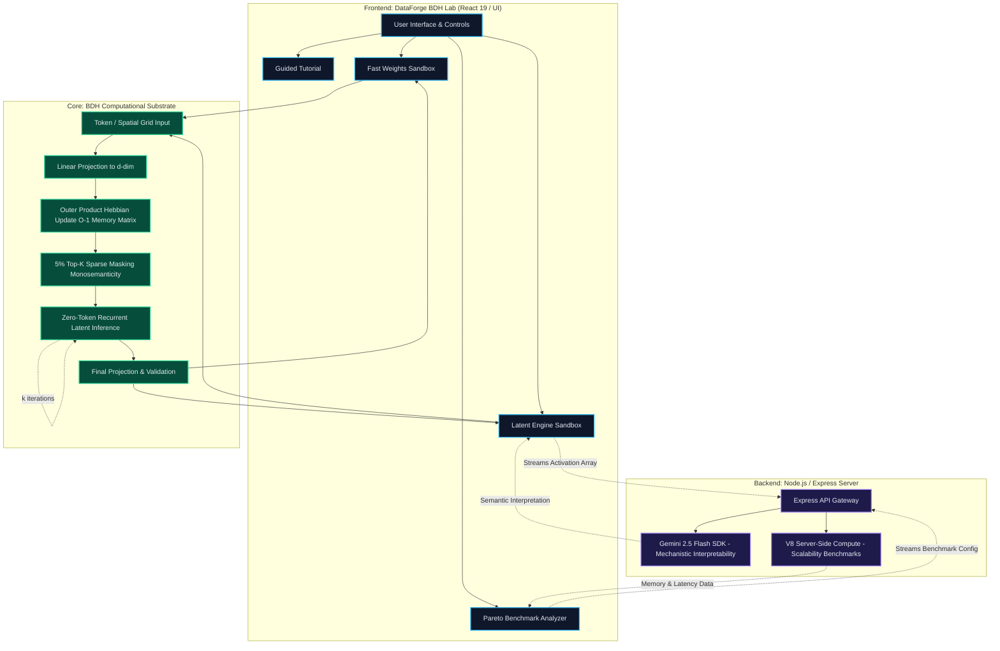

# 🧬 DataForge BDH Lab: Frontier AI Explainer

> **An interactive computational laboratory explaining Pathway's Dragon Hatchling (BDH & BDH-CQ) architectures, Hebbian fast weight matrices, 5% monosemantic sparse activations, zero-token latent reasoning, and 2-bit codebook quantization.**


---

## 🌟 Executive Overview & Problem Statement

Standard Large Language Models (Transformers) rely on **Key-Value (KV) caches** that store keys and values for every processed token. This introduces a **quadratic memory scaling bottleneck** $\mathcal{O}(N^2)$, causing memory overhead to explode as sequence lengths scale into hundreds of thousands or millions of tokens.

**Pathway's Dragon Hatchling (BDH)** and its quantized variant **BDH-CQ** represent a paradigm shift in neural architecture:

1. **Hebbian Fast Weight Matrices ($W_{fast} \in \mathbb{R}^{d \times d}$)**: Instead of unbounded KV-caches, associations are written into a fixed-size fast weight matrix via outer product updates: $W_{fast} \leftarrow (1-\lambda)W_{fast} + \eta (k \otimes v)$. This guarantees constant $\mathcal{O}(1)$ memory overhead regardless of sequence length.
2. **5% Top-K Monosemantic Sparsity**: Activations are masked to retain only the top 5% strongest non-negative values. This eliminates dense polysemantic interference and yields sharp, interpretable feature disentanglement.
3. **Zero-Token Latent Reasoning Engine**: BDH performs multi-step recurrent mental iterations directly within its hidden latent space before generating an output, eliminating token output generation latency and energy overhead.
4. **BDH-CQ 2-Bit Codebook Quantization**: Compresses high-dimensional vectors into 2-bit codebook indices, unlocking maximum memory bandwidth efficiency on modern GPU/TPU hardware.

**DataForge BDH Lab** is a full-stack, interactive computational workbench designed for competition judges, data scientists, machine learning engineers, and educators.

---

## 🚀 Key Features & Interactive Sandboxes

### 1. 🎓 Guided Interactive Tour (`GuidedTutorial.tsx`)
- A 5-step pedagogical walk-through taking users from Transformer KV-cache bottlenecks to BDH fast weight matrices, 5% sparsity, zero-token latent recurrence, and BDH-CQ 2-bit quantization.
- Interactive matrix update controls, real-time activation sparsity sliders, and ARC-like spatial reasoning solvers.

### 2. ⚡ Synaptic Sandbox - Hebbian Fast Weights (`FastWeightsSandbox.tsx`)
- **Real-Time Matrix Substrate**: Live mathematical simulation of outer product updates $W_{fast} \leftarrow (1-\lambda)W_{fast} + \eta (k \otimes v)$.
- **$O(1)$ vs $O(N^2)$ Memory Overhead Comparator**: Live memory usage tracker comparing BDH against standard Transformer KV-caches as context length scales up to 1,000,000 tokens.
- **Catastrophic Forgetting & Decay Slider**: Interactive decay parameter $\lambda \in [0.00, 0.20]$ demonstrating memory retention vs. interference trade-offs.
- **2D Matrix Synaptic Heatmap (`MatrixHeatmap.tsx`)**: Interactive visual grid showing real-time weight values across $W_{fast}$ dimensions.
- **Interactive Neural Flow (`NeuralFlowVisualizer.tsx`)**: High-fidelity visualizer illustrating signal propagation through input projection, Hebbian update, Top-K sparse masking, and output decoding layers.

### 3. 🧠 Zero-Token Latent Engine Sandbox (`LatentEngineSandbox.tsx`)
- Multi-step recurrent mental iteration engine $h_{\tau+1} = \text{ReLU}(W h_\tau + W_{fast} x)$ performing latent reasoning without generating intermediate tokens.
- **ARC Grid Pattern Solver (`GridVisualizer.tsx`)**: Solves spatial logic grids through 1-8 recurrent iterations, showing real-time state convergence and confidence metrics.
- Energy and throughput benchmark comparing zero-token reasoning vs. traditional chain-of-thought token generation.

### 4. 🔬 BDH & BDH-CQ Architecture Deep Dive (`BdhArchitectureDeepDive.tsx`)
- **Monosemantic Sparsity Explorer**: Visualizes neuron firing profiles across 0% to 50% activation sparsity, highlighting the optimal 5% monosemantic threshold.
- **Non-Negative Activation Comparison**: Side-by-side analysis of ReLU vs GELU in enforcing positive firing rates.
- **2-Bit Codebook Quantization Math**: Interactive BDH-CQ compression breakdown showing vector quantization error and memory bandwidth savings.

### 5. 📊 Pareto Benchmark & Efficiency Analyzer (`ParetoBenchmarkAnalyzer.tsx`)
- Dynamic interactive scatter graph (`ParetoGraph.tsx`) evaluating BDH, BDH-CQ, Transformer, Mamba, and RWKV models across memory efficiency, latency, and reasoning capability.
- Interactive sequence length and batch size sliders for real-time memory and throughput extrapolation.

### 6. 📖 360° Interactive Term Explorer (`TermExplorer.tsx`)
- Deep-dive dictionary overlay featuring 20+ specialized frontier AI concepts (Hebbian Learning, Monosemanticity, Outer Product Updates, Catastrophic Forgetting, BDH-CQ, etc.).
- Accessible across all modes via a floating launcher button or inline term highlights.

### 7. 🎭 Audience Role Adaptability (`ClaimBanner.tsx`)
- Real-time perspective switching tailored for:
  - **Judges (Pathway Track)**: Focus on mathematical matrix validity, zero-token recurrence, and 5% Top-K sparsity.
  - **Learners (Data Scientists)**: Focus on intuitive matrix updates and memory scaling comparisons.
  - **Educators (NeurIPS Track)**: Focus on self-contained open-source classroom visualization.

### 8. 🎨 Cybernetic App Loader (`AppLoader.tsx`)
- Sleek 2.8-second animated matrix initialization splash screen featuring rotating orbital rings, synaptic node pulse indicators, and real-time status stage updates. Replayable on-demand via the header.

---

## ⚙️ Architecture & Core Workflow

The following flowchart details the robust data pipeline and computational logic mapping the end-to-end user experience, from the frontend interactions to the backend simulation engine.



---

## 🏗️ Tech Stack & Architecture

```
┌─────────────────────────────────────────────────────────────────┐
│                    DataForge BDH Lab Frontend                   │
│         React 19 • TypeScript • Tailwind CSS v4 • Motion       │
└────────────────────────────────┬────────────────────────────────┘
                                 │
                                 ▼
┌─────────────────────────────────────────────────────────────────┐
│                     Express Backend Server                      │
│      Node.js 20 • Vite Middleware (Dev) • Static Serving (Prod) │
└────────────────────────────────┬────────────────────────────────┘
                                 │
                                 ▼
┌─────────────────────────────────────────────────────────────────┐
│               Google Cloud Run Container Runtime                │
│    Port 3000 • Graceful SIGTERM Shutdown • Health Probes        │
└─────────────────────────────────────────────────────────────────┘
```

- **Frontend**: React 19, TypeScript 5.8, Tailwind CSS v4, Motion (`motion/react`), Lucide Icons, Canvas/SVG visualizers.
- **Backend**: Express 4, Node.js 20, Vite 6.
- **Containerization**: Multi-stage `Dockerfile` (`node:20-alpine`), `.dockerignore`.
- **Deployment**: Google Cloud Run, Cloud Build, Artifact Registry.

---

## 🛠️ Local Development & Quick Start

### Prerequisites
- **Node.js**: v20.0.0 or higher
- **npm**: v10.0.0 or higher

### Installation & Execution

```bash
# 1. Clone the repository
git clone https://github.com/DebadyutiBarui2007-Debug/Data_Forge_Data_Lab.git
cd Data_Forge_Data_Lab

# 2. Install dependencies
npm install

# 3. Start development server (with Vite HMR)
npm run dev
```
Open [http://localhost:3000](http://localhost:3000) in your browser.

### Build for Production

```bash
# Compile Vite frontend bundle and esbuild Express server
npm run build

# Start production Express server
npm start
```

### Code Quality & Type Checks

```bash
npm run lint
```

---

## ☁️ Google Cloud Run & Docker Pipelines

### Option 1: Direct Cloud Run Deployment (Source-to-Cloud)

```bash
gcloud run deploy dataforge-bdh-lab \
  --source . \
  --region us-central1 \
  --platform managed \
  --allow-unauthenticated \
  --port 3000 \
  --memory 512Mi \
  --cpu 1 \
  --min-instances 0 \
  --max-instances 10 \
  --set-env-vars NODE_ENV=production
```

### Option 2: Docker Multi-Stage Container Build

#### Build & Push Container to Artifact Registry
```bash
# Create Artifact Registry Repository
gcloud artifacts repositories create bdh-repo \
  --repository-format=docker \
  --location=us-central1 \
  --description="Docker repository for DataForge BDH Lab"

# Submit build via Cloud Build
gcloud builds submit --tag us-central1-docker.pkg.dev/YOUR_PROJECT_ID/bdh-repo/dataforge-bdh-lab:v1

# Deploy container image to Cloud Run
gcloud run deploy dataforge-bdh-lab \
  --image us-central1-docker.pkg.dev/YOUR_PROJECT_ID/bdh-repo/dataforge-bdh-lab:v1 \
  --region us-central1 \
  --platform managed \
  --allow-unauthenticated \
  --port 3000
```

---

## 📂 Project Directory Structure

```
dataforge-bdh-lab/
├── .dockerignore
├── CLOUD_RUN.md                   # Cloud Run deployment manual
├── Dockerfile                     # Multi-stage production container
├── README.md                      # Main project documentation
├── metadata.json                  # Application metadata
├── package.json                   # Build scripts & dependencies
├── server.ts                      # Express production server & dev middleware
├── vite.config.ts                 # Vite setup
├── src/
│   ├── App.tsx                    # Main root component & mode switcher
│   ├── index.css                  # Global Tailwind CSS v4 styles
│   ├── main.tsx                   # React entry point
│   ├── types.ts                   # Shared TypeScript definitions
│   ├── components/                # UI components & visualizers
│   │   ├── AppLoader.tsx          # 2.8s animated matrix splash screen
│   │   ├── BdhArchitectureDeepDive.tsx
│   │   ├── ClaimBanner.tsx
│   │   ├── FastWeightsSandbox.tsx
│   │   ├── GridVisualizer.tsx
│   │   ├── GuidedTutorial.tsx
│   │   ├── Header.tsx             # Header with mode navigation & replay button
│   │   ├── LatentEngineSandbox.tsx
│   │   ├── MatrixHeatmap.tsx
│   │   ├── NeuralFlowVisualizer.tsx
│   │   ├── ParetoBenchmarkAnalyzer.tsx
│   │   ├── ParetoGraph.tsx
│   │   ├── TermExplorer.tsx       # 360° term dictionary overlay
│   └── engine/                    # Core computational matrix substrate
│       ├── bdhSimulation.ts       # Memory & catastrophic forgetting model
│       ├── latentReasoningEngine.ts # Zero-token recurrent latent solver
│       └── matrixEngine.ts        # Outer product fast weight matrix updates
```

---

## 🏅 Hackathon & Track Acknowledgment

Built for the **National DataForge 2026 Hackathon (Pathway Track)** and submitted to the **NeurIPS 2026 Education Track**.

Special thanks to **Pathway AI** for pioneering Dragon Hatchling (BDH) and high-performance real-time vector processing architectures.

---

## 📜 License

Distributed under the **MIT License**. See `LICENSE` for details.
